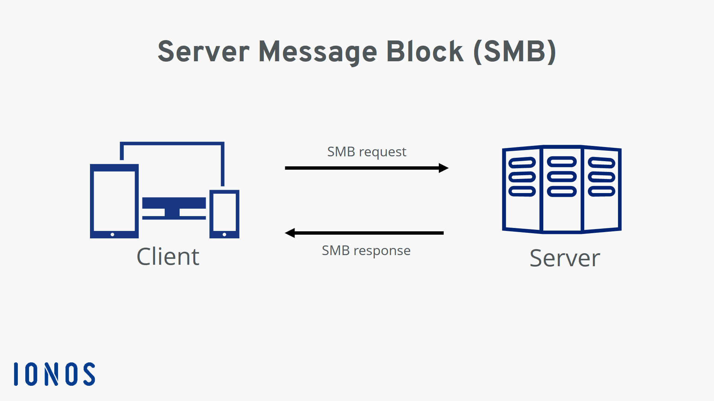

## Intro
This is another Very Easy machine from the Starting Point section on HackTheBox. As is typical, besides just getting the root flag, we will need to answer some questions.

## Tasks

### Task 1: What does the 3-letter acronym SMB stand for?
```
Server Message Block
```

### Task 2: What port does SMB use to operate at?
```
445
```

### Task 3: What network communication model does SMB use, architecturally speaking?
Let's Google a bit and find a diagram of the architecture used in SMB:


Thus, the answer would be:
```
Client-Server Model
```

### Task 4: What is the service name for port 445 that came up in our nmap scan?
For this question, let's start an nmap scan and see what we have.
```bash
weaponizedpeach@Akatosh:~$ nmap 10.129.1.12
Starting Nmap 7.80 ( https://nmap.org ) at 2022-02-20 00:53 EET
Nmap scan report for 10.129.1.12
Host is up (0.044s latency).
Not shown: 997 closed ports
PORT    STATE SERVICE
135/tcp open  msrpc
139/tcp open  netbios-ssn
445/tcp open  microsoft-ds

Nmap done: 1 IP address (1 host up) scanned in 1.86 seconds
weaponizedpeach@Akatosh:~$
```

According to the output results, the answer should be:
```
microsoft-ds
```

### Task 5: What is the tool we use to connect to SMB shares from our Linux distribution?
While there are a few, we most commonly will use:
```
smbclient
```

### Task 6: What is the `flag` or `switch` we can use with the SMB tool to `list` the contents of the share? 

Let's pull up the help output of `smbclient` to find out:

```bash
weaponizedpeach@Akatosh:~$ smbclient -h
Usage: smbclient [-?EgqBVNkPeC] [-?|--help] [--usage] [-R|--name-resolve=NAME-RESOLVE-ORDER]
        [-M|--message=HOST] [-I|--ip-address=IP] [-E|--stderr] [-L|--list=HOST]
        [-m|--max-protocol=LEVEL] [-T|--tar=<c|x>IXFvgbNan] [-D|--directory=DIR]
        [-c|--command=STRING] [-b|--send-buffer=BYTES] [-t|--timeout=SECONDS] [-p|--port=PORT]
        [-g|--grepable] [-q|--quiet] [-B|--browse] [-d|--debuglevel=DEBUGLEVEL]
        [-s|--configfile=CONFIGFILE] [-l|--log-basename=LOGFILEBASE] [-V|--version]
        [--option=name=value] [-O|--socket-options=SOCKETOPTIONS] [-n|--netbiosname=NETBIOSNAME]
        [-W|--workgroup=WORKGROUP] [-i|--scope=SCOPE] [-U|--user=USERNAME] [-N|--no-pass]
        [-k|--kerberos] [-A|--authentication-file=FILE] [-S|--signing=on|off|required]
        [-P|--machine-pass] [-e|--encrypt] [-C|--use-ccache] [--pw-nt-hash] service <password>
```

`[-L|--list=HOST]` seems promising. Let's try it!

```bash
weaponizedpeach@Akatosh:~$ smbclient -L 10.129.1.12
Enter WORKGROUP\weaponizedpeach's password:

        Sharename       Type      Comment
        ---------       ----      -------
        ADMIN$          Disk      Remote Admin
        C$              Disk      Default share
        IPC$            IPC       Remote IPC
        WorkShares      Disk
SMB1 disabled -- no workgroup available
weaponizedpeach@Akatosh:~$
```

Seems like a success. The switch would be:

```
-L
```

### Task 7: What is the name of the share we are able to access in the end?
The SMB share `WorkShares` does not exist by default, so it stands out. Let's try it out first.

```
weaponizedpeach@Akatosh:~$ smbclient \\\\10.129.1.12\\WorkShares
Enter WORKGROUP\weaponizedpeach's password:
Try "help" to get a list of possible commands.
smb: \> ls
  .                                   D        0  Mon Mar 29 11:22:01 2021
  ..                                  D        0  Mon Mar 29 11:22:01 2021
  Amy.J                               D        0  Mon Mar 29 12:08:24 2021
  James.P                             D        0  Thu Jun  3 11:38:03 2021

                5114111 blocks of size 4096. 1753477 blocks available
```

Nice, we have a couple of directories to choose from.

### Task 8: What is the command we can use within the SMB shell to download the files we find? 
For this we can pull up the SMB `help` menu and check what it has in store:
```bash
Try "help" to get a list of possible commands.
smb: \> help
?              allinfo        altname        archive        backup
blocksize      cancel         case_sensitive cd             chmod
chown          close          del            deltree        dir
du             echo           exit           get            getfacl
geteas         hardlink       help           history        iosize
lcd            link           lock           lowercase      ls
l              mask           md             mget           mkdir
more           mput           newer          notify         open
posix          posix_encrypt  posix_open     posix_mkdir    posix_rmdir
posix_unlink   posix_whoami   print          prompt         put
pwd            q              queue          quit           readlink
rd             recurse        reget          rename         reput
rm             rmdir          showacls       setea          setmode
scopy          stat           symlink        tar            tarmode
timeout        translate      unlock         volume         vuid
wdel           logon          listconnect    showconnect    tcon
tdis           tid            utimes         logoff         ..
!
smb: \>
```

Let's look which command stands out the most that we could use to download files:
```
get
```

### Submit root flag
Let's continue from where we stopped at the end of Task 7 and check out the directory `James. P`.
```bash
smb: \> cd James.P
smb: \James.P\> ls
  .                                   D        0  Thu Jun  3 11:38:03 2021
  ..                                  D        0  Thu Jun  3 11:38:03 2021
  flag.txt                            A       32  Mon Mar 29 12:26:57 2021

                5114111 blocks of size 4096. 1753477 blocks available
```

Awesome, right there is our flag, let's download it and finish this box :)

```bash
smb: \James.P\> get flag.txt
getting file \James.P\flag.txt of size 32 as flag.txt (0.2 KiloBytes/sec) (average 0.2 KiloBytes/sec)
smb: \James.P\> exit
weaponizedpeach@Akatosh:~$ cat flag.txt
5f61c10dffbc77a704d76016a22f1664
weaponizedpeach@Akatosh:~$
```

Per usual, we need to provide the flag in the format `HTB{flag}`. And so, the flag is `HTB{5f61c10dffbc77a704d76016a22f1664}`

## Outro
Another short and simple box from the Starting Point set of machines. I like that HackTheBox mixes in Windows machines as well, not just Unix/Linux ones. And since SMB is so prevalent amongst Windows boxes, I think it is useful to touch on it as well.